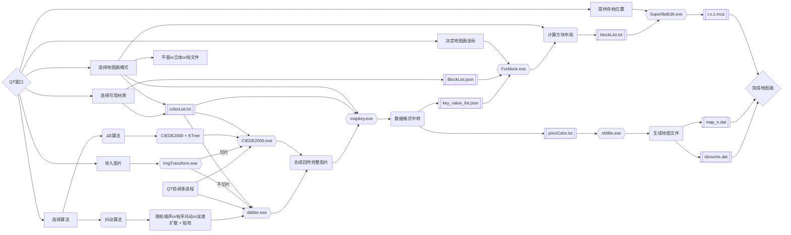

# MC-map-drawing-ETO

###### 创建我的世界地图画，正在更新nbt版本，目前处于施工状态 ~

# 处理流程
###### LR/TB

```mermaid
graph LR

A{QT窗口} --> AA[选择地图画模式]
A{QT窗口} --> AB[选择可用材质]
A{QT窗口} --> AC[导入图片]
A{QT窗口} --> AD[选择算法]
A{QT窗口} --> AE[决定地图画坐标]
A{QT窗口} --> AF[提供存档位置]
B(QT协调多进程) --> ADAA{{CIEDE2000.exe}}
ACAA -- 切片 --> ADAA{{CIEDE2000.exe}}
AD --> ADA(ΔE算法) --> ADAAA(CIEDE2000 + KTree) --> ADAA{{CIEDE2000.exe}}
CAA --> CAAAB[[key_value_list.json]] --> D{{Forblock.exe}}
ABB --> D{{Forblock.exe}}
AE --> D{{Forblock.exe}}
D --> DA(计算方块布局)
AA --> AAA[平面or立体or纯文件]
CAA --> CAAAA[[pixivColor.txt]]
CAAAA --> E{{nbtfile.exe}}
AB --> ABA[[colorList.txt]]
AB --> ABB[[BlockList.json]]
AA --> ABA[[colorList.txt]]
AC --> ACAA{{ImgTransform.exe}}
AD --> ADB(抖动算法)
ADB --> ADBAA(随机噪声or有序抖动or误差扩散 + 矩阵) --> ADBA{{didder.exe}}
B(QT协调多进程) --> ADBA{{didder.exe}}
ADBA{{didder.exe}} --> C(合成回传完整图片)
ACAA -- 不切片 --> ADBA{{didder.exe}}
ABA --> ADBA{{didder.exe}}
ADAA --> C(合成回传完整图片)
C --> CAAA{{mapkey.exe}} --> CAA(数据格式中转)
ABA --> CAAA{{mapkey.exe}}
AA --> CAAA{{mapkey.exe}}
E{{nbtfile.exe}} --> EA(生成地图文件)
AA --> DA(计算方块布局)
DA(计算方块布局) --> DAA[[blockList.txt]]
ABA --> ADAA{{CIEDE2000.exe}}
DAA --> GA{{SuperflatEdit.exe}}
EA(生成地图文件) --> EAA[[idcounts.dat]] --> Z{完成地图画}
EA(生成地图文件) --> EAB[[map_n.dat]] --> Z{完成地图画}
GA --> GAA[[r.x.z.mca]] --> Z{完成地图画}
AF --> GA{{SuperflatEdit.exe}}

```
